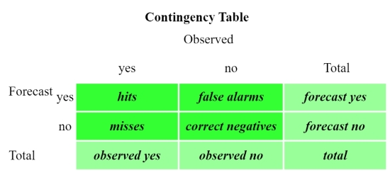

```{r packages, include=FALSE}
knitr::opts_chunk$set(echo = FALSE, warning = FALSE, message = FALSE)
library(here)
library(ggplot2)
library(lubridate)
library(reshape2)
library(viridis)
library(RColorBrewer)
library(tidyr)
library(hydroGOF)
library(stringr)
library(knitr)
library(kableExtra)
library(rnaturalearthdata)
library(rnaturalearth)
library(ggrepel)
library(sp)
library(tibble)
library(verification)
library(purrr)
library(dplyr)
```

```{r setup, include=FALSE}
source(here("src", "helper_funs.R"))

zm <- readRDS(here("data", "station", "cleaned", "zambia_station_cleaned.RDS"))
if(anyDuplicated(zm %>% dplyr::select(station, date))) stop("Duplicates found!")
zm <- zm %>% 
  dplyr::select(station, date, rain, chirps_rain, chirp_rain, era5_rain, tamsat_rain, agera5_rain)
# 1 Aug = 214
s_doy_start <- 214
zm <- zm %>% mutate(doy = yday_366(date),
                    year = year(date),
                    month = month(date),
                    s_doy = (doy - s_doy_start + 1) %% 366,
                    s_doy = ifelse(s_doy == 0, 366, s_doy),
                    syear = year,
                    syear = ifelse(s_doy > (366 - s_doy_start + 1), syear - 1, syear),
                    month = factor(month, levels = c(8:12, 1:7)),
                    month_abb = factor(month, labels = month.abb[c(8:12, 1:7)]),
                    rain = ifelse(rain < 0, 0, rain),
                    era5_rain = ifelse(era5_rain < 0, 0, era5_rain),
                    chirps_rain = ifelse(chirps_rain < 0, 0, chirps_rain), 
                    chirp_rain = ifelse(chirp_rain < 0, 0, chirp_rain), 
                    tamsat_rain = ifelse(tamsat_rain < 0, 0, tamsat_rain),
                    agera5_rain = ifelse(agera5_rain <0, 0, agera5_rain)
                    )

zm_long_st <- zm %>% 
  melt(id.vars = c("station", "date", "year", "syear", "month", "month_abb", 
                   "doy", "s_doy", "rain"),
       measure.vars = names(zm)[endsWith(names(zm), "rain")][-1],
       variable.name = "product", value.name = "pr_rain")

zm_long <- zm %>% 
  melt(id.vars = c("station", "date", "year", "syear", "month", "month_abb", "doy", "s_doy"),
       measure.vars = names(zm)[endsWith(names(zm), "rain")],
       variable.name = "product", value.name = "rain") %>%
  mutate(rainday = rain > 1)

zm_long$product <- recode(zm_long$product, rain = "station")

stations <- c("Moorings", "Choma", "Kasama", "Livingstone", "Magoye", "Mansa", "Mpika", "Chipata", "Petauke")
products <- levels(zm_long$product)
products <- products[-1]
names(products) <- substr(products, 1, nchar(products) - 5)

metadata_zm <- readRDS(here("data", "station", "cleaned", "zambia_station_metadata_cleaned.RDS"))

metadata_zm$station <- factor(metadata_zm$station, levels = stations)
zm_long$station <- factor(zm_long$station, levels = stations)

by_station <- zm_long %>%
  group_by(station) %>%
  filter(!is.na(rain) & product == "station") %>%
  summarise(first_date = first(date),
            last_date = last(date))

metadata_zm <- left_join(metadata_zm, by_station, by = "station")
rm(by_station)

zm_long <- left_join(zm_long, metadata_zm, by = "station")

zm_long <- zm_long %>% 
  filter(date >= first_date & date <= last_date)

skable <- function(kable_input) {
  kable_input %>% kable_styling(bootstrap_options = c("striped", "hover", "condensed"),
                                full_width = FALSE)
}
```

```{r}
station_min_date <- min((zm %>% filter(!is.na(rain) ))$date)
station_max_date <- max((zm %>% filter(!is.na(rain) ))$date)

chirps_min_date <-  min((zm %>% filter(!is.na(chirps_rain) ))$date)
chirps_max_date <-  max((zm %>% filter(!is.na(chirps_rain) ))$date)

chirp_min_date <- min((zm %>% filter(!is.na(chirp_rain) ))$date)
chirp_max_date <-  max((zm %>% filter(!is.na(chirp_rain) ))$date)

agera5_min_date <-  min((zm %>% filter(!is.na(agera5_rain) ))$date)
agera5_max_date <-  max((zm %>% filter(!is.na(agera5_rain) ))$date)

tamsat_min_date <-  min((zm %>% filter(!is.na(tamsat_rain) ))$date)
tamsat_max_date <-  max((zm %>% filter(!is.na(tamsat_rain) ))$date)

era5_min_date <-  min((zm %>% filter(!is.na(era5_rain) ))$date)
era5_max_date <-  max((zm %>% filter(!is.na(era5_rain) ))$date)

min_date <- max(station_min_date, chirps_min_date, chirp_min_date, agera5_min_date, tamsat_min_date, era5_min_date)
max_date <- min(station_max_date, chirps_max_date, chirp_max_date, agera5_max_date, tamsat_max_date, era5_max_date)

zm_long <- zm_long %>% 
  #filter(date >= min_date & date <= max_date)
  filter(syear >= year(min_date))
zm_long_st <- zm_long_st %>% 
  #filter(date >= min_date & date <= max_date)
  filter(syear >= year(min_date))
```


### Distribution of rainfall amounts
```{r}
prop_amounts <- zm_long %>% 
  filter(rain >= 0) %>%
  mutate(rain_grps = cut(rain,
                          breaks = c(0, 0.85, 5, 20, 40, Inf),
                           include.lowest = TRUE, right = FALSE)) %>%
  group_by(station, product, rain_grps) %>%
  summarise(n = n()) %>%
  mutate(prop = n/sum(n), cumul = cumsum(prop))

prop_gg <- ggplot(prop_amounts, aes(x = rain_grps, y = prop, fill = product)) +
  geom_col(position = "dodge") +  
  xlab("Rainfall intensity categories") + 
  ylab("Proportion of rain") + 
  scale_fill_manual(values = c("#66C2A5", "#FC8D62", "#8DA0CB", "#E78AC3", "#A6D854", "gray70")) +
  facet_wrap(~station) 

ggsave(here("results", "intensity", 
              paste0("zambia_", "proportion_of_rain", ".png")),
         plot = prop_gg, width = 12, height = 6)
prop_gg
  #scale_fill_brewer(palette="Set2")

prop_amounts %>%
 filter(station == "Livingstone") %>%
  rename("station_name" = station) %>%
  pivot_wider(names_from = product, values_from = cumul, id_cols = c(station_name, rain_grps)) %>%
  kable(digits = 2) %>%
  skable()
```


```{r}
prop_amounts %>% 
  filter(station == "Livingstone") %>% 
  rename("station_name" = station) %>%
  pivot_wider(names_from = product, values_from = n) %>% group_by(station_name, rain_grps) %>% summarise(station = sum(station, na.rm = TRUE), chirps_rain = sum(chirps_rain, na.rm = TRUE), chirp_rain = sum(chirp_rain, na.rm = TRUE), era5_rain = sum(era5_rain, na.rm = TRUE), tamsat_rain = sum(tamsat_rain, na.rm = TRUE), agera5_rain = sum(agera5_rain, na.rm = TRUE)) %>%
  kable(digits = 2) %>%
  skable()
  
```


```{r}
pod_df <- zm_long_st %>% mutate(st_rain_dry = rain < 0.85,
                      st_light_rain = (rain >= 0.85 & rain < 5),
                      st_moderate_rain = (rain >= 5 & rain < 20),
                      st_heavy_rain = (rain >= 20 & rain < 40),
                      st_violent_rain = rain >= 40,
                      pr_rain_dry = pr_rain < 0.85,
                      pr_light_rain = (pr_rain >= 0.85 & pr_rain < 5),
                      pr_moderate_rain = (pr_rain >= 5 & pr_rain < 20),
                      pr_heavy_rain = (pr_rain >= 20 & pr_rain < 40),
                      pr_violent_rain = pr_rain >= 40
       ) %>% 
  mutate(TP_dry = (st_rain_dry == TRUE & pr_rain_dry == TRUE), 
         TP_light_rain = (st_light_rain == TRUE & pr_light_rain == TRUE),
         TP_moderate_rain = (st_moderate_rain == TRUE & pr_moderate_rain == TRUE),
         TP_heavy_rain = (st_heavy_rain == TRUE & pr_heavy_rain == TRUE),
         TP_violent_rain = (st_violent_rain == TRUE & pr_violent_rain == TRUE),
         FN_dry = (st_rain_dry == TRUE & pr_rain_dry == FALSE), 
         FN_light_rain = (st_light_rain == TRUE & pr_light_rain == FALSE),
         FN_moderate_rain = (st_moderate_rain == TRUE & pr_moderate_rain == FALSE),
         FN_heavy_rain = (st_heavy_rain == TRUE & pr_heavy_rain == FALSE),
         FN_violent_rain = (st_violent_rain == TRUE & pr_violent_rain == FALSE)
         ) %>% 
  group_by(station, product)%>% 
  summarise(
    pod_dry = sum(TP_dry, na.rm = T)/(sum(TP_dry, na.rm = T) + sum(FN_dry, na.rm = T)),
    pod_light_rain = sum(TP_light_rain, na.rm = T)/(sum(TP_light_rain, na.rm = T) + sum(FN_light_rain, na.rm = T)),
    pod_moderate_rain = sum(TP_moderate_rain, na.rm = T)/(sum(TP_moderate_rain, na.rm = T) + sum(FN_moderate_rain, na.rm = T)),
    pod_heavy_rain = sum(TP_heavy_rain, na.rm = T)/(sum(TP_heavy_rain, na.rm = T) + sum(FN_heavy_rain, na.rm = T)),
    pod_violent_rain = sum(TP_violent_rain, na.rm = T)/(sum(TP_violent_rain, na.rm = T) + sum(FN_violent_rain, na.rm = T))
  ) %>%
  pivot_longer(cols = pod_dry:pod_violent_rain, names_to = "rain_grps", values_to = "pod") 

pod_df$rain_grps <- factor(pod_df$rain_grps, levels = c("pod_dry", "pod_light_rain", "pod_moderate_rain", "pod_heavy_rain", "pod_violent_rain"))

pod_gg <- ggplot(pod_df, aes(x = rain_grps, y = pod, fill = product)) +
  geom_col(position = "dodge") +  
  xlab("Rainfall intensity categories") + 
  ylab("Probability of detection") + 
  scale_fill_brewer(palette="Set2") + 
  scale_x_discrete(breaks=c("pod_dry", "pod_light_rain", "pod_moderate_rain", "pod_heavy_rain", "pod_violent_rain"),
                   labels=c("Dry", "Light", "Moderate", "Heavy", "Violent")) +
  facet_wrap(~station) 
ggsave(here("results", "intensity", 
              paste0("zambia_", "rain_intensity_prob_of_detection", ".png")),
         plot = pod_gg, width = 12, height = 6)
pod_gg
```


### Detection of rainfall on the same days (November to April)



```{r raindays_verify}
raindays <- zm_long_st %>% 
  mutate(st_rainday0p85 = rain > 0.85,
         pr_rainday0p85 = pr_rain > 0.85,
         pr_rainday3 = pr_rain > 3,
         pr_rainday5 = pr_rain > 5)

sverify <- function(df, obs, pred) {
  v <- verification::verify(obs = df[[obs]], pred = df[[pred]], 
                       obs.type = "binary", frcst.type = "binary")
  class(v) <- "list"
  v
}

by_st_pr <- raindays %>%
  group_by(station, product) %>%
  nest() %>%
  mutate(v = purrr::map(data, sverify, obs = "st_rainday0p85", pred = "pr_rainday0p85"),
         bias = purrr::map_dbl(v, "BIAS"))
```

```{r cont_tables, results="asis"}
cont_tables <- function(df, name) {
  df %>%
    kable(caption = name, digits = 2, format.args = list(big.mark = ",")) %>%
    skable() %>%
    row_spec(nrow(df), bold = TRUE)
}

rain_levs <- c("rain", "no_rain")
ver_zm <- raindays %>%
  group_by(product, station) %>%
  filter(month %in% c(11:12, 1:4)) %>%
  filter(!is.na(st_rainday0p85) & !is.na(pr_rainday0p85)) %>%
  summarise(hit = sum(st_rainday0p85 & pr_rainday0p85),
            fa = sum(!st_rainday0p85 & pr_rainday0p85),
            miss = sum(st_rainday0p85 & !pr_rainday0p85),
            cneg = sum(!st_rainday0p85 & !pr_rainday0p85),
            n = n(),
            accuracy = (hit + cneg)/n,
            bias = (hit + fa)/(hit + miss),
            hit_rate = hit/(hit + miss),
            far = fa/(hit + fa),
            ts = hit/(hit + miss + fa),
            ets = verification::verify(obs = st_rainday0p85, pred = pr_rainday0p85, 
                                       obs.type = "binary", frcst.type = "binary")$ETS,
            miss_frac = miss/n #,
            #hk = (hit/(hit + miss) - (fa/(fa + cneg))),
            #hss = verification::verify(obs = st_rainday0p85, pred = pr_rainday0p85, 
                                       #obs.type = "binary", frcst.type = "binary")$HSS
            ) %>%
  arrange(product, station)

measures <- c("accuracy", "bias", "hit_rate", "far", "ts", "ets", "miss_frac")#, "hk", "hss")
names(measures) <- c("Accuracy: What fraction of the estimates were correct?
                     (hits + correct negative)/total (1 = perfect)",
                     "Bias: Ratio of number of rain days from estimate over number of rain days from station. 
                     (hits + false alarms)/(hits + misses) (1 = perfect)",
                     "Hit rate (probability of detection) What fraction of the station rain days were correctly estimated? hits/(hits + misses) (1 = perfect)",
                     "False alarm ratio: What fraction of the estimated rain days actually did not rain? false alarms/(hits + false alarms)",
                     "Threat score: How well did the estimate rain days correspond to the observed rain days?",
                     "Equitable threat score: How well did the estimate rain days correspond to the station rain days (accounting for hits due to chance)?",
                     "Proportion of misses: How many rain days in the station were not detected by the estimate?"#,
                     #"Hanssen and Kuipers discriminant: How well did the forecast separate the rainy days from the dry days? Uses all elements in the contingency table.",
                     #"Heidke skill score: What was the accuracy of the forecast relative to that of random chance? Measures the fraction of correct estimates after eliminating those estimates which would be correct due purely to random chance."
                     )
for(i in seq(measures)) {
  df <- ver_zm %>% 
    dplyr::select(product, station, measures[[i]]) %>%
    pivot_wider(id_cols = station, names_from = product, values_from = measures[[i]])
  names(df)[endsWith(names(df), "rain")] <- substr(names(df)[endsWith(names(df), "rain")],
                                                   1, 
                                                   nchar(names(df)
                                                         [endsWith(names(df), "rain")]
                                                         ) 
                                                   - 5)
  df[nrow(df) + 1, ] <- c(list("(All)"), as.list(as.numeric(colMeans(df[ , -1]))))
  print(cont_tables(df, names(measures)[i]))
}
```